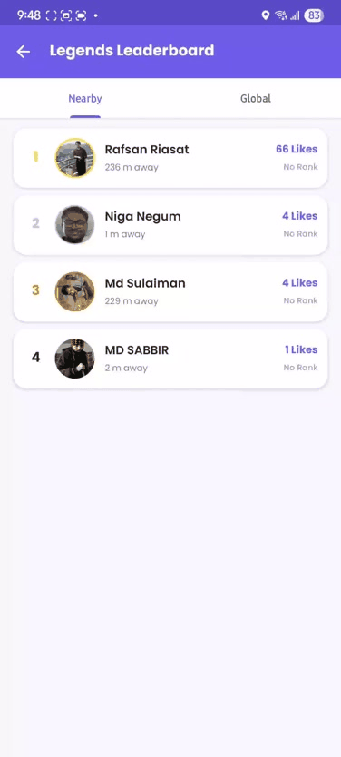
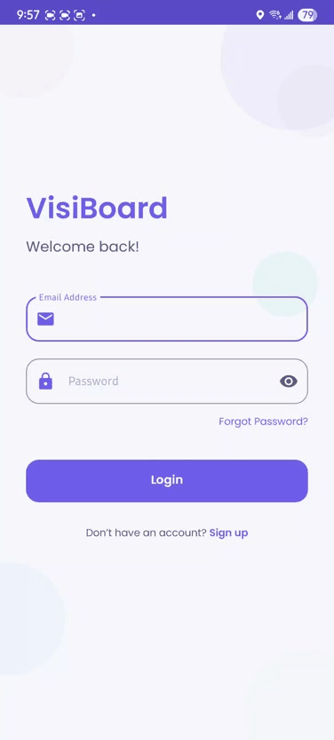
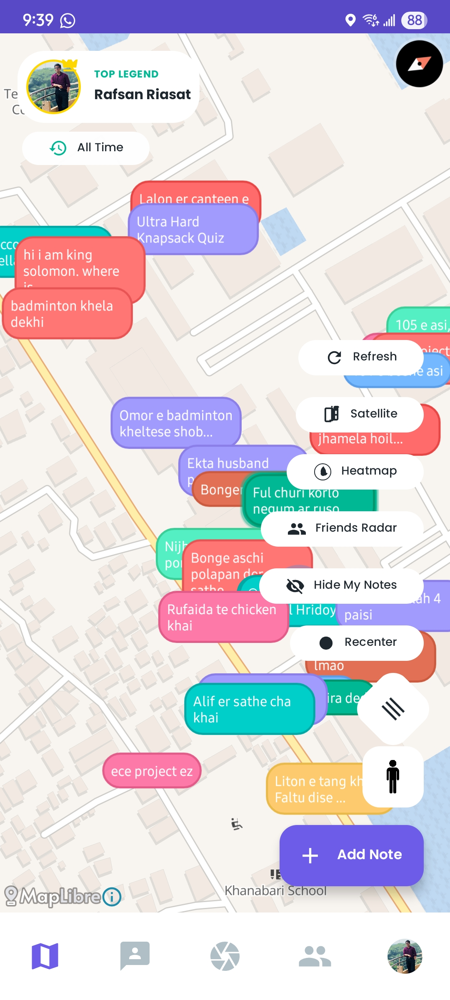
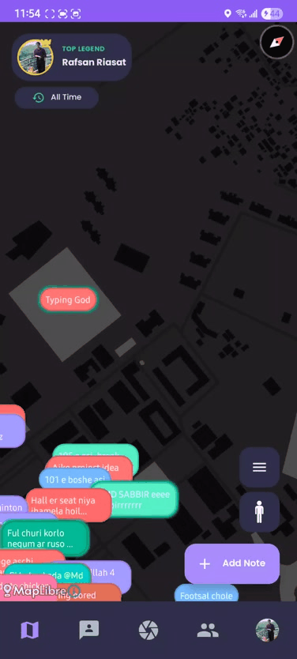
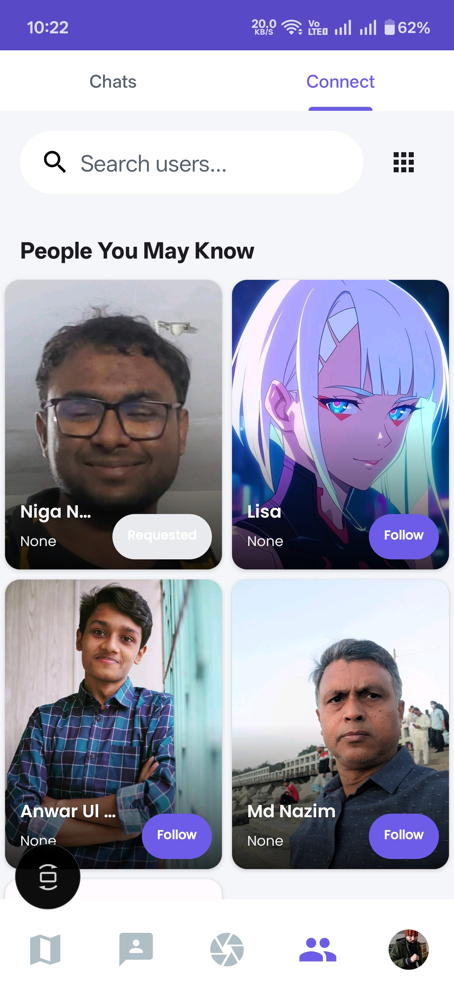
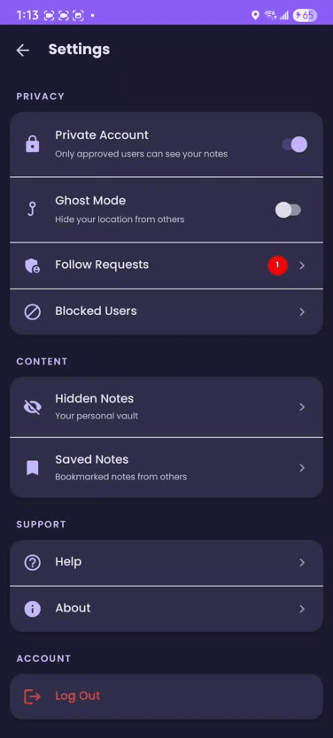
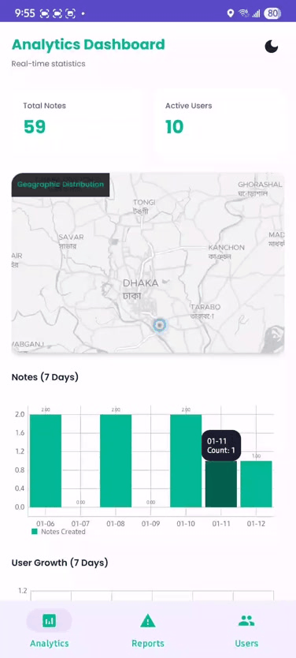
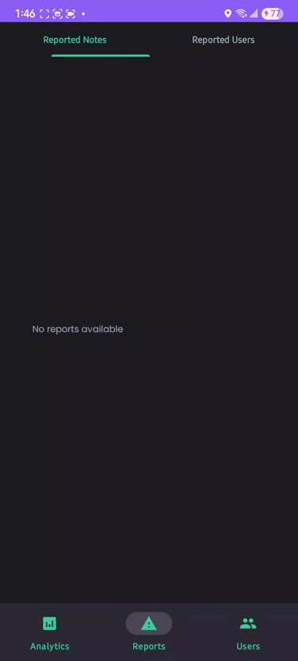
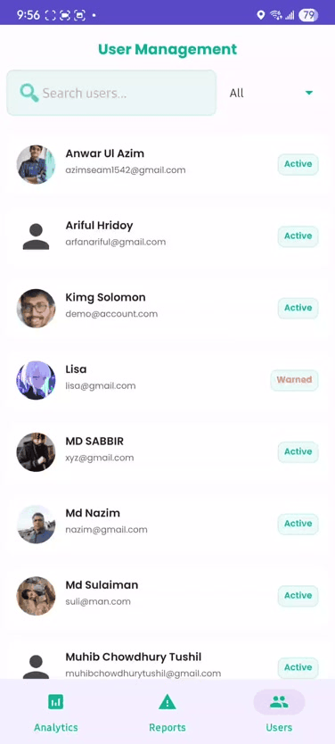

<div align="center">

# VisiBoard 📍

**A Location-Based Social Platform for Android**

_Connect digital stories to physical places and transform how you interact with your surroundings._

[](https://www.android.com/)
[](https://firebase.google.com/)
[](https://maplibre.org/)
[](https://developers.google.com/ml-kit)
[](https://m3.material.io/)

---

### 🎥 Quick Preview

|                              Map & Legends                              |                              Discover Feed                              |                            Real-time Chat                            |
| :---------------------------------------------------------------------: | :---------------------------------------------------------------------: | :------------------------------------------------------------------: |
|  |  |  |

</div>

---

## 📖 Table of Contents

- [Overview](#-overview)
- [Key Features](#-key-features)
- [Architecture](#-architecture)
- [Tech Stack](#-tech-stack)
- [Screenshots](#-screenshots)
- [Getting Started](#-getting-started)
- [Project Structure](#-project-structure)
- [Author](#-author)
- [License](#-license)

---

## 🌟 Overview

VisiBoard is a next-generation social media platform that blends the physical and digital worlds. Users can drop geo-tagged notes ("VisiNotes") at real-world locations, discover stories from their surroundings through an interactive map or a Pinterest-style feed, and connect with others through shared experiences tied to places.

The platform features a custom-built Geo-AR engine for placing notes in augmented reality, a physics-based UI for interactive user profiles, and a sophisticated "Smart Tetris" layout algorithm for the discovery feed.

---

## ✨ Key Features

### 🗺️ Interactive Map Engine

- **Real-time Note Markers**: Explore geo-tagged notes rendered dynamically on the map with custom, theme-aware icons.
- **Stickman Remote Drop**: A unique, physics-based animation allowing users to drop a note at any location on the map by dragging and releasing a "stickman" character.
- **Legends System**: A gamified leaderboard showcasing top contributors, displayed directly on the map.
- **Heatmap & Satellite Views**: Toggle between styles to visualize note density or terrain.

### 📷 Geo-AR Capture Mode

- **Augmented Reality Engine**: A custom-built engine that projects nearby notes into the camera's live feed based on GPS, compass, and gyroscope data.
- **Depth Parallax Effects**: Distant notes move more than close notes when the device is tilted, simulating 3D depth.
- **Radar View**: A minimap overlay showing the direction and distance of all nearby notes.
- **ML Kit Integration**: Built-in OCR for text recognition and barcode/QR scanning.
- **Camera Filters**: Real-time color filters (B&W, High Contrast, Cool, Warm) applied to captured images.

### 🧩 Smart Discovery Feed

- **Pinterest-Style Masonry Layout**: A visually dense "staggered grid" feed using `StaggeredGridLayoutManager`.
- **Smart Tetris Algorithm**: A custom packing algorithm that detects layout gaps and injects interactive "Fidget Widgets" to fill them, ensuring a perfectly balanced layout.
- **Interactive Fidget Widgets**: 6 unique, physics-based mini-games embedded in the feed:
  - `GravityBallView`: A tethered ball that reacts to device tilt and touch.
  - `LavaLampView`: Fluid meta-ball animation.
  - `NeonTraceView`: An interactive touch-trail drawing surface.
  - `FloatingBubblesView`, `FluidCellView`, `SonicStringsView`.

### 💬 Real-time Messaging

- **Firebase Realtime Database**: Millisecond-level message synchronization.
- **Multimedia Support**: Send text, images (via ImgBB), and voice notes.
- **Typing Indicators & Read Receipts**: Live status updates during conversations.
- **Message Reactions & Replies**: React to messages with emojis and reply to specific messages inline.

### 👤 Interactive User Profiles

- **Physics-Based Canvas**: User favorites and badges float and collide in an interactive `FloatingPhysicsLayout`.
- **Tiered Rank System**: Users progress through ranks (Bronze → Silver → Gold → Diamond → Platinum) based on engagement.
- **@Mentions System**: Tag other users in notes with autocomplete suggestions from the "Following" list.

### 🔒 Privacy & Safety

- **Granular Visibility Controls**: Notes can be set to Public, Followers Only, or Private (Only Me).
- **Block & Hide**: Block users or hide individual notes.
- **Follow Request Approval**: For private accounts, approve or deny incoming follow requests.
- **Comprehensive Reporting**: Report users or notes with categorized reasons, triggering the admin review pipeline.

### 🛡️ Admin Dashboard (Android & JavaFX Desktop)

- **User Management**: View user details, issue warnings, apply temporary restrictions with expiry dates, or permanent bans.
- **Report Queue**: Review and act on user/note reports with a single click.
- **Platform Analytics**: Visualize user growth, active users, note creation trends, and engagement metrics using MPAndroidChart.

### ⚡ Performance & Caching

- **3-Tier Caching**: Memory (LRU) → Disk → Network architecture for instant loading.
- **Image Optimization**: Smart downsampling and `RGB_565` format to reduce memory footprint.
- **Background Preloading**: Intelligently prefetches user profiles and images to eliminate loading states.
- **Room Database**: Offline caching for feed notes and user data.

---

## 🏗️ Architecture

The application follows a layered architecture pattern, separating concerns into distinct packages.

```
┌─────────────────────────────────────────────────────────────────────────┐
│                            Presentation Layer                           │
│  ┌─────────────────────────────────────────────────────────────────┐   │
│  │   Activities & Fragments (UI)                                   │   │
│  │   MapFragment | FeedFragment | CaptureFragment | ChatActivity   │   │
│  └─────────────────────────────────────────────────────────────────┘   │
│  ┌─────────────────────────────────────────────────────────────────┐   │
│  │   Custom Views                                                  │   │
│  │   FloatingPhysicsLayout | GraphicOverlay | Fidget Widgets       │   │
│  └─────────────────────────────────────────────────────────────────┘   │
├─────────────────────────────────────────────────────────────────────────┤
│                              Logic Layer                                │
│  ┌─────────────────────────────────────────────────────────────────┐   │
│  │   Managers & Helpers (Singletons)                               │   │
│  │   ChatManager | CacheManager | UserCache | PreloadManager       │   │
│  └─────────────────────────────────────────────────────────────────┘   │
│  ┌─────────────────────────────────────────────────────────────────┐   │
│  │   ViewModels (MVVM)                                             │   │
│  │   ProfileViewModel | FeedViewModel                              │   │
│  └─────────────────────────────────────────────────────────────────┘   │
├─────────────────────────────────────────────────────────────────────────┤
│                               Data Layer                                │
│  ┌───────────────────────────────┬─────────────────────────────────┐   │
│  │   Remote (Firebase)           │   Local (Room)                  │   │
│  │   Firestore (Notes, Users)    │   AppDatabase                   │   │
│  │   Realtime DB (Chat)          │   CachedUser, CachedFeedNote    │   │
│  │   Storage (Images)            │   DiskCache (Images)            │   │
│  └───────────────────────────────┴─────────────────────────────────┘   │
└─────────────────────────────────────────────────────────────────────────┘
```

---

## 🛠️ Tech Stack

| Category          | Technology                                                              |
| :---------------- | :---------------------------------------------------------------------- |
| **Language**      | Java                                                                    |
| **UI Framework**  | Material Design 3, ViewPager2, RecyclerView, StaggeredGridLayoutManager |
| **Architecture**  | MVVM with LiveData and ViewModel                                        |
| **Maps**          | MapLibre GL (with Geoapify tiles)                                       |
| **Backend**       | Firebase (Firestore, Authentication, Storage, Realtime Database)        |
| **Local Storage** | Room Database, SharedPreferences, LRU Disk/Memory Cache                 |
| **Image Loading** | Glide with custom caching strategies                                    |
| **ML/AI**         | Google ML Kit (Text Recognition, Barcode Scanning)                      |
| **Camera**        | CameraX (Preview, ImageAnalysis, ImageCapture)                          |
| **Charts**        | MPAndroidChart                                                          |
| **Networking**    | Retrofit, OkHttp (for ImgBB image uploads)                              |

---

## 📱 Screenshots

<div align="center">

### ✨ Core Experience

|                          Authentication                           |                          Map & Notes                          |                             Remote Drop                             |
| :---------------------------------------------------------------: | :-----------------------------------------------------------: | :-----------------------------------------------------------------: |
|  |  |  |

---

### 🌐 Discovery & Social

|                              Discover Feed                               |                                Profile                                |                        People You May Know                        |
| :----------------------------------------------------------------------: | :-------------------------------------------------------------------: | :---------------------------------------------------------------: |
|  |  |  |

---

### 💬 Communication

|                         Real-time Chat                          |                        Post Details                        |                              AR Capture                               |
| :-------------------------------------------------------------: | :--------------------------------------------------------: | :-------------------------------------------------------------------: |
|  |  |  |

---

### ⚙️ Settings & Admin

|                              Settings                              |                              Admin Analytics                              |                            Admin Reports                             |
| :----------------------------------------------------------------: | :-----------------------------------------------------------------------: | :------------------------------------------------------------------: |
|  |  |  |

|                                 Admin Users                                 |
| :-------------------------------------------------------------------------: |
|  |

</div>

---

## 🚀 Getting Started

### Prerequisites

- Android Studio Hedgehog (2023.1.1) or later
- JDK 17+
- A Firebase project
- A Geoapify API key

### Setup

1.  **Clone the repository**

    ```bash
    git clone https://github.com/AnonX9/VisiBoard.git
    cd VisiBoard
    ```

2.  **Configure Firebase**

    - Create a new project at [Firebase Console](https://console.firebase.google.com/).
    - Add an Android app with your package name (`com.visiboard.app`).
    - Download `google-services.json` and place it in the `app/` directory.
    - Enable the following Firebase services:
      - **Authentication** (Email/Password, Google Sign-In)
      - **Cloud Firestore**
      - **Realtime Database**
      - **Cloud Storage**

3.  **Add API Keys**

    - Get a free API key from [Geoapify](https://www.geoapify.com/).
    - Add the key to `MapFragment.java` or a `local.properties` / `secrets.xml` file.

4.  **Build and Run**
    ```bash
    ./gradlew assembleDebug
    ```
    Or open the project in Android Studio and click **Run**.

---

## 📁 Project Structure

```
VisiBoard/
├── app/                              # Android Application Module
│   ├── src/main/java/com/visiboard/app/
│   │   ├── ui/                       # UI Layer (Activities & Fragments)
│   │   │   ├── admin/                # Admin Dashboard (Analytics, Reports, User Mgmt)
│   │   │   ├── auth/                 # Login, Signup, Onboarding
│   │   │   ├── capture/              # AR Capture, Camera, GraphicOverlay, RadarView
│   │   │   ├── connect/              # Chats List, Discovery/Suggestions
│   │   │   ├── create/               # Note Composition (Mentions, Image Picker)
│   │   │   ├── feed/                 # Discover Feed, Fidget Widgets
│   │   │   ├── map/                  # MapFragment, Note Markers, Stickman Physics
│   │   │   ├── profile/              # User Profile, FloatingPhysicsLayout
│   │   │   ├── report/               # Report Bottom Sheet
│   │   │   └── settings/             # Settings, Blocked Users, Follow Requests
│   │   ├── chat/                     # Chat Logic (ChatManager, MessagesAdapter)
│   │   ├── data/                     # Data Models, Room DAOs, Repositories
│   │   ├── utils/                    # Caching, Helpers, Theme Management
│   │   └── workers/                  # Background WorkManager Tasks
│   └── res/                          # Resources (Layouts, Drawables, Values)
└── screenshots/                      # App Screenshots and GIFs for Documentation
```

---

## 👨‍💻 Author

**Rafsan Riasat**

- **Roll**: 2207006
- **Department**: Computer Science and Engineering (CSE)
- **Institution**: Khulna University of Engineering & Technology (KUET)

---

## 📄 License

This project is developed as part of academic coursework at KUET. All rights reserved.

---

<div align="center">

**Built with blood, sweat, and tears by Rafsan Riasat**

_Connecting Stories to Places_

</div>
