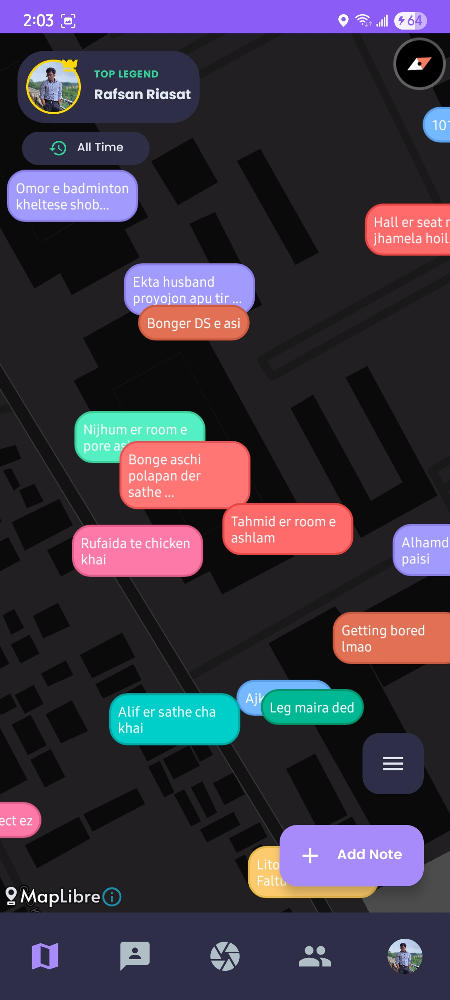
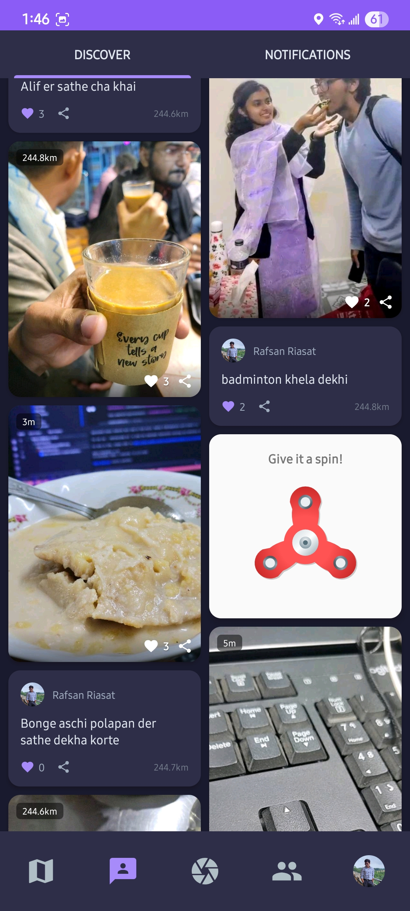
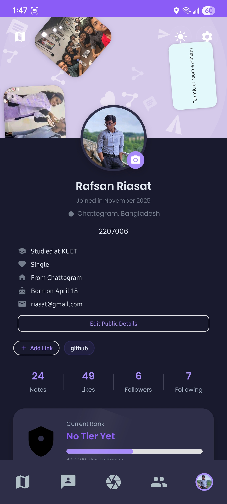
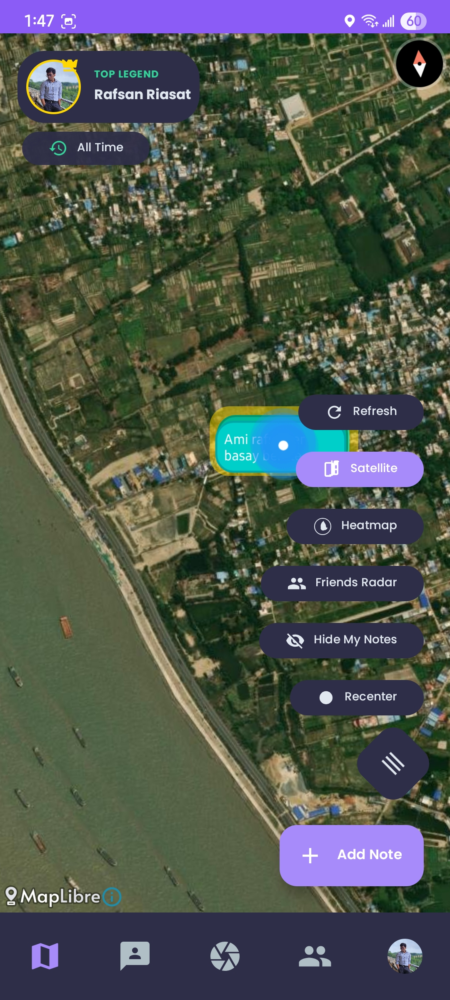
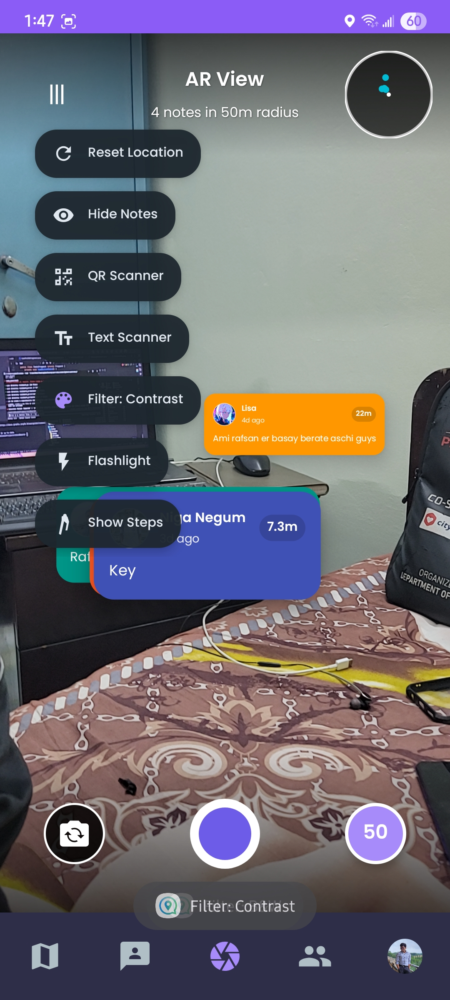

# VisiBoard 📍

<div align="center">

**A Location-Based Social Platform for Android**

*Connect digital stories to physical places and transform how you interact with your surroundings.*

[](https://www.android.com/)
[](https://firebase.google.com/)
[]()

</div>

---

## 🌟 Overview

VisiBoard is a social media platform that blends the physical and digital worlds. Drop geo-tagged notes at real locations, discover stories from your surroundings, and connect with people through shared experiences tied to places.

## ✨ Key Features

### 🗺️ Location & Discovery
- **Interactive Map View** - Explore geo-tagged notes on a dynamic, real-time map interface
- **Discover Feed** - Browse trending content in a Pinterest-style masonry grid layout
- **Nearby Content** - Find notes and stories from your current location
- **People You May Know** - Discover connections based on location and mutual follows

### 📝 Content Creation
- **Create Posts** - Share text, images, and multimedia content at your location
- **AR Capture Mode** - Drop notes using augmented reality camera integration
- **Image Recognition** - Built-in OCR and barcode scanning with ML Kit
- **Multiple Formats** - Support for text, images, and location-based content

### 👥 Social Interaction
- **Real-time Chat** - Direct messaging with online status and read receipts
- **Follow System** - Connect with users and see their content in your feed
- **Engagement** - Like, comment, and share notes with your network
- **Voice Messages** - Send voice recordings in chats

### 🔒 Privacy & Security
- **Private Accounts** - Control who can see your content and follow you
- **Follow Requests** - Approve or deny follow requests for private accounts
- **Content Visibility** - Choose between public, followers-only, or private notes
- **Block & Report** - Comprehensive moderation tools for users and content
- **5-Strike System** - Automatic protection from spam follow requests

### 🎨 Personalization
- **Dark/Light Themes** - Seamless theme switching with system integration
- **Custom Profiles** - Personalize your profile with bio, links, and favorite notes
- **Achievement System** - Unlock tiers (Bronze → Platinum) based on engagement
- **Profile Physics** - Interactive profile headers with physics animations
- **Favorite Notes** - Pin your best content to your profile

### 📊 Analytics & Admin
- **User Analytics** - Track followers, notes, and engagement statistics
- **Admin Dashboard** - Comprehensive moderation and analytics tools (Android + JavaFX Desktop)
- **Report Management** - Handle user and content reports with action tracking
- **User Management** - Ban, restrict, warn users with expiry dates
- **Platform Statistics** - Monitor user growth, content trends, and engagement metrics

### 🚀 Performance
- **Multi-tier Caching** - Memory + Disk + Network architecture for instant loading
- **Image Optimization** - Smart downsampling and RGB_565 format for memory efficiency
- **Offline Support** - Browse cached content without network connectivity
- **Preloading** - Intelligent prefetching eliminates loading states
- **Smooth Scrolling** - 60fps performance with LRU caching and background processing

### There are more - you just have to discover them yourself!

## 📱 Screenshots

<div align="center">

### Main Features

| Map View | Discover Feed | Connect & Chat |
|:---:|:---:|:---:|
|  |  |  |

### Social & Content

| Post Interaction | Chat Interface | User Profile |
|:---:|:---:|:---:|
|  |  |  |

### Additional Highlights

| Map Details | AR Capture | Settings |
|:---:|:---:|:---:|
|  |  |  |

</div>

## 🛠️ Android Tech Stack

- **Language**: Java
- **UI Framework**: Material Design Components, ViewPager2, RecyclerView
- **Architecture**: MVVM with LiveData and ViewModel
- **Maps**: MapLibre (Geoapify API)
- **Backend**: Firebase (Firestore, Authentication, Storage, Realtime Database)
- **Local Storage**: Room Database for offline caching
- **Image Loading**: Glide with custom LRU cache
- **ML/AI**: ML Kit for Text Recognition and Barcode Scanning
- **Camera**: CameraX for AR capture mode
- **Charts**: MPAndroidChart for analytics visualization


## 🏗️ Project Structure

```
VisiBoard/
├── app/                          # Android application
│   ├── src/main/java/com/visiboard/app/
│   │   ├── ui/                  # UI components (Activities & Fragments)
│   │   │   ├── auth/           # Login, Signup
│   │   │   ├── feed/           # Discover feed & notifications
│   │   │   ├── map/            # Map view & navigation
│   │   │   ├── profile/        # User profiles
│   │   │   ├── create/         # Note creation
│   │   │   ├── connect/        # Chat & discovery
│   │   │   ├── settings/       # App settings
│   │   │   └── admin/          # Admin features
│   │   ├── data/               # Data models & Room database
│   │   ├── chat/               # Chat functionality
│   │   ├── utils/              # Utilities & caching
│   │   └── workers/            # Background workers
│   └── res/                    # Resources (layouts, drawables)
└── screenshots/                # App screenshots
```

## 🚀 Getting Started

### Prerequisites
- Android Studio Arctic Fox or later
- JDK 11+
- Firebase project setup
- Geoapify API key

### Setup

1. **Clone the repository**
   ```bash
   git clone https://github.com/yourusername/VisiBoard.git
   cd VisiBoard
   ```

2. **Configure Firebase**
   - Create a Firebase project at [Firebase Console](https://console.firebase.google.com/)
   - Download `google-services.json` and place it in `app/`
   - Enable Authentication, Firestore, Storage, and Realtime Database

3. **Add API Keys**
   - Get a Geoapify API key from [Geoapify](https://www.geoapify.com/)
   - Update the API key in map-related classes

4. **Build and Run**
   ```bash
   ./gradlew assembleDebug
   ```

## 👨‍💻 Author

**Rafsan Riasat**  
*Roll*: 2207006  
*Department*: Computer Science and Engineering (CSE)  
*Institution*: Khulna University of Engineering & Technology (KUET)

## 📄 License

This project is developed as part of academic coursework at KUET.

---

<div align="center">

**Built with ❤️ by Rafsan Riasat**

*Connecting Stories to Places*

</div>
