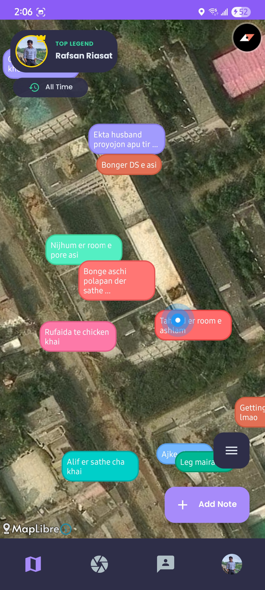
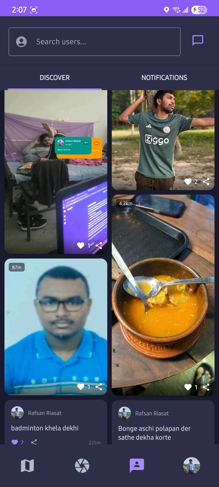
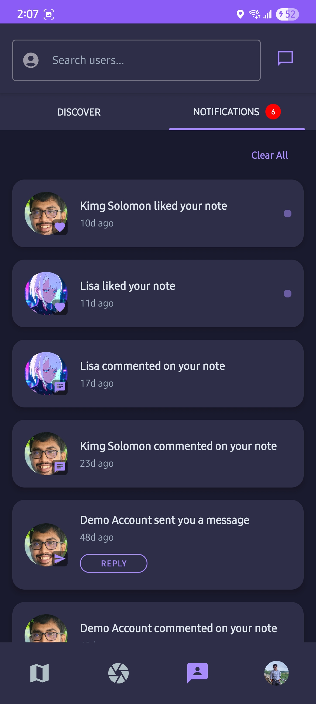

# VisiBoard 📍

**VisiBoard** is a location-based social platform for **Android** that allows users to discover and share stories tied to real-world places. By connecting digital notes to physical locations, VisiBoard transforms how you interact with your surroundings.

> **Note**: This project is currently under active development. New features are being added regularly.

## ✨ Implemented Features

*   **Interactive Map**: Explore geo-tagged notes and stories on a dynamic map interface.
*   **Discover Feed**: Browse trending and nearby notes in a visually engaging masonry grid layout.
*   **Create & Capture**: Drop your own notes at your current location to share with the world.
*   **Social Interaction**: Follow other users, like meaningful content, and participate in comment discussions.
*   **User Profiles**: customizable profiles displaying user stats and note history.
*   **Real-time Notifications**: Stay updated with interactions and activities from your network.

## 📱 Screenshots

| Map Exploration | Discover Feed |
|:---:|:---:|
|  |  |

| User Profile | Notifications | Capture Mode |
|:---:|:---:|:---:|
|  |  |  |

## 👨‍💻 Author

**Rafsan Riasat**
*   **Roll**: 2207006
*   **Department**: Computer Science & Engineering (CSE)
*   **Institution**: Khulna University of Engineering & Technology (KUET)
